

<h1>TikTokPlugin</h1>

 *Seamlessly connect Unreal Engine to any TikTok Live* 

# Introduction
**TikTokPlugin** is a plugin inspired by [TikTokLive](https://github.com/isaackogan/TikTokLive) and powered by the [TikTokLiveJava](https://github.com/jwdeveloper/TikTokLiveJava) library. The plugin enables seamless integration of TikTok livestream interactions into Unreal Engine with the click of a button. This is achieved by encapsulating a lightweight Java runtime and a Node.js WebSocket server within the C++ plugin, allowing smooth communication between the Java application and Unreal Engine's C++ classes.

With **TikTokPlugin**, you can connect to any TikTok livestream and use viewer interactions—such as comments, likes, and gifts—to trigger real-time in-game events. This plugin is designed to elevate live-streamed gaming experiences by leveraging TikTok's vibrant interactivity.

## Tutorial

Watch the full tutorial on how to set up and use TikTokPlugin in your Unreal Engine project:

Click the image above or [watch the tutorial here](https://www.youtube.com/watch?v=n3EzKqyDghQ).

# Features
- **Event-driven architecture**: Listens for events like comments, likes, and gifts.

- **Custom game logic**: Use data to trigger animations, spawn objects, and modify game states. The possibilities are endless!

- **Self-contained setup**: Plugin includes a lightweight Java runtime and NodeJS websocket server bundled with the plugin, handling network connection with zero setup.

---
---

## Getting Started

### Installation

#### Unreal Engine Integration
1. Clone or download the **TikTokPlugin** repository.
2. Copy the plugin folder for [YOUR ENGINE VERSION] into your Unreal Engine project's `Plugins` directory.
* 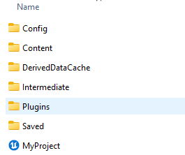

3. Enable the plugin in the Unreal Engine editor. (Should be automatic)
* 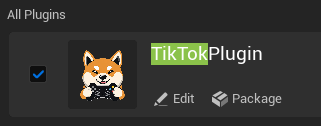
4. Start project.

#### Inside Unreal
1. Create blueprint -GameInstance. Name this whatever you want.
* 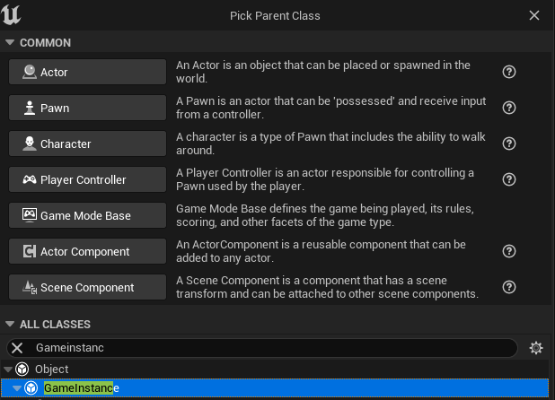
2. Inside GameInstance, right-click and get the EventShutdown node, connect this to the TikTokPlugin [Close TikTok Connection] node. This closes the java process every time you stop gameplay, preventing duplicate instances. 
* 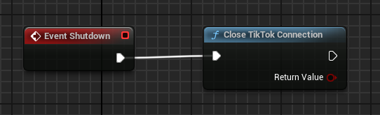
3. Create test blueprint actor. **PLACE ACTOR INTO WORLD**
4. After BeginPlay, create the blueprint node [Connect to TikTok Live]. Pass in a string parameter for whatever user you want to connect to. 
* 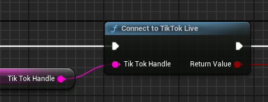
5. On successful connection, create a blueprint node [Get TikTok Event Handler]. This will be the event handler that you bind functions to.
* 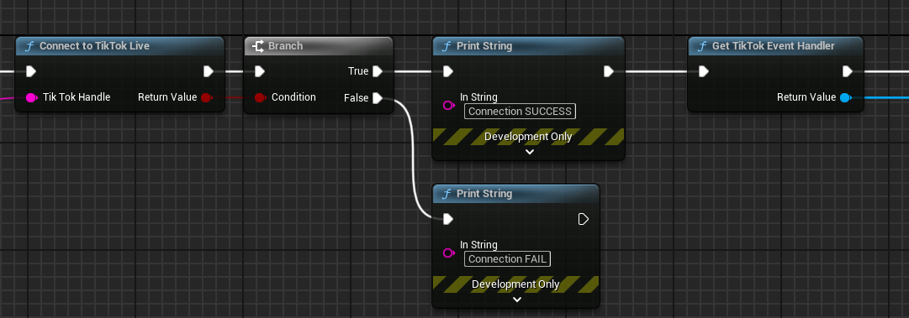

#### Binding Events.
1. Drag off of the event handler and type in 'Bind event on'. You will see the 6 events that are currently available. 
-   **OnGift** --> Returns Username, UserID, User Profile Pic URL, Gift Type, Gift Value. 
* 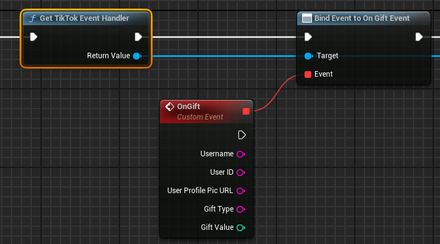
-   **OnComment** --> Returns Username, UserID, User Profile Pic URL, User Comment.
* 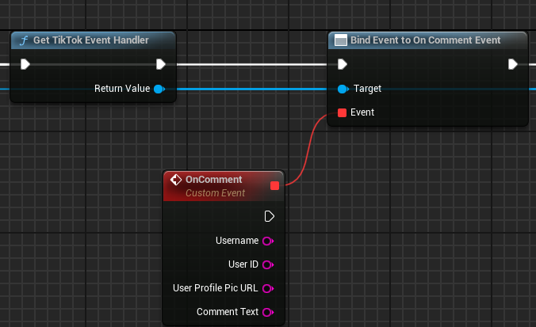
-   **OnLike** --> Returns Username, UserID, User Profile Pic URL, Like Count.
* 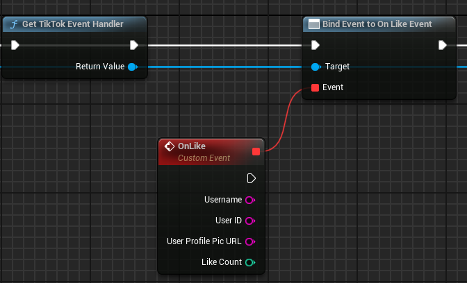
-   **OnShare** --> Returns Username, UserID, User Profile Pic URL, User Share Count.
* 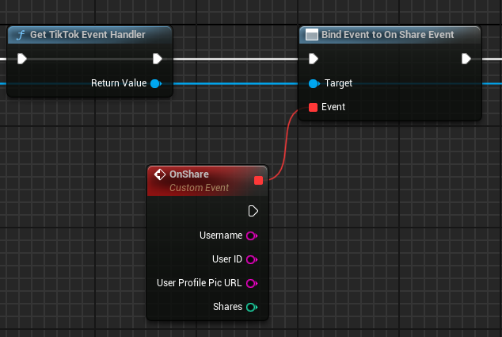
-   **OnFollow** --> Returns Username, UserID, User Profile Pic URL, Bool Already Following.
* 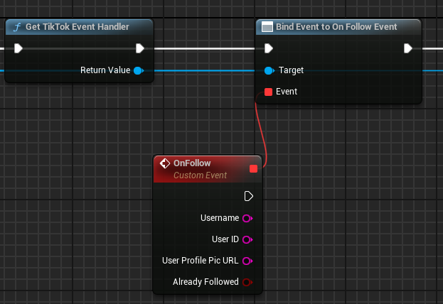
-   **OnRoomInfo** --> Returns Room Title, Viewer Count.
* 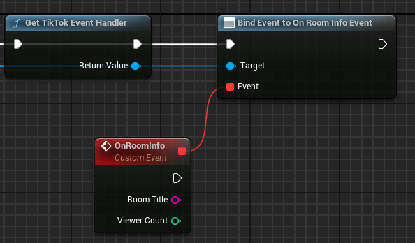

--- 
### Don't Forget To Favorite the Github!